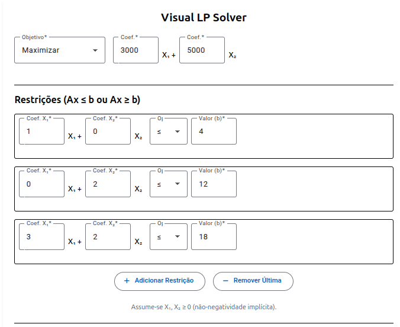
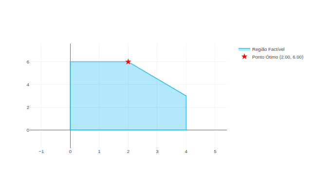
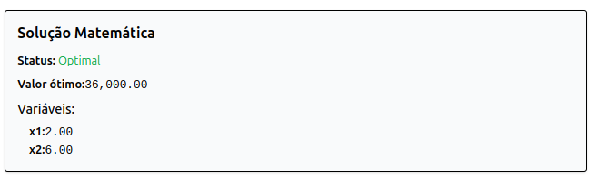

# PL2-solver

## Otimizador Linear Visual (Visual LP Solver)

[](https://opensource.org/licenses/MIT) Uma aplicação web full-stack para resolver problemas de Programação Linear (PL) com duas variáveis. Permite a entrada de funções objetivo e restrições, calcula a solução ótima e exibe uma visualização gráfica interativa da região factível e do ponto ótimo.





## Visão Geral

Este projeto consiste em:

* **Frontend:** Uma interface de usuário interativa construída com Angular, usando Angular Material para componentes e Plotly.js para a visualização gráfica.
* **Backend:** Uma API REST construída com Django e Django REST Framework, utilizando PuLP para resolver os problemas de PL e NumPy para cálculos geométricos necessários para determinar a região factível.

## Funcionalidades

* Interface para definir problemas de PL de 2 variáveis (objetivo, coeficientes, restrições).
* Adição/Remoção dinâmica de restrições (mínimo de 2).
* Validação de entradas no formulário.
* Resolução numérica exibindo status, valor ótimo e variáveis ótimas.
* Visualização gráfica da região factível e ponto ótimo.
* Indicador de carregamento durante o processamento.
* Funcionalidade para resetar o formulário.

## Tecnologias Utilizadas

* **Frontend:** Angular 19, Plotly.js, Angular Material, Tailwind CSS, RxJS
* **Backend:** Python 3.12.3, Django 5.2, Django REST Framework, PuLP, NumPy, Matplotlib

## Pré-requisitos

Para rodar este projeto localmente, você precisará ter instalado:

* [Git](https://git-scm.com/)
* [Python](https://www.python.org/downloads/) (versão 3.10 ou superior) e Pip
* [Node.js](https://nodejs.org/) (versão 18 ou superior) e Npm (ou [Yarn](https://yarnpkg.com/))

## Configuração Local

Siga estes passos para configurar o ambiente de desenvolvimento:

**1. Clone o Repositório**

```bash
git clone https://github.com/jonascamargoo/PL2-solver.git
cd PL2-solver

```
**2. Inicialização do backend**

Navegue até a pasta do backend
```bash
cd backend
```
Crie um ambiente virtual (altamente recomendado) e o ative

```bash
python -m venv .venv
```
Ative o ambiente virtual
```bash
## Linux/macOS:
    source .venv/bin/activate
## Windows (cmd):
    .venv\Scripts\activate.bat
## Windows (PowerShell):
    .venv\Scripts\Activate.ps1
```

Instale as dependências Python listadas em requirements.txt

```bash
pip install -r requirements.txt
```
Inicialize Django
```bash
python manage.py runserver

ou

python3 manage.py runserver
```
**3. Inicialização do frontend**

Navegue até a pasta do frontend (a partir da raiz do projeto)

```bash
cd ../ui
```

Instale as dependências do Node.js

```bash
npm install
```
Inicialize Angular
```bash
npm run start
```

